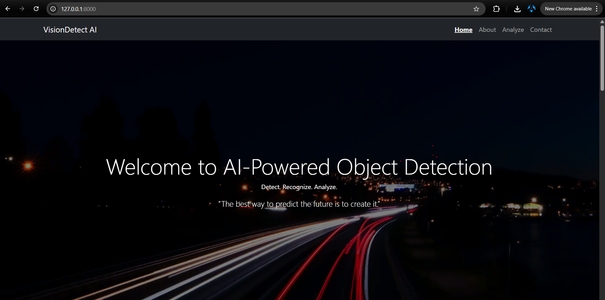
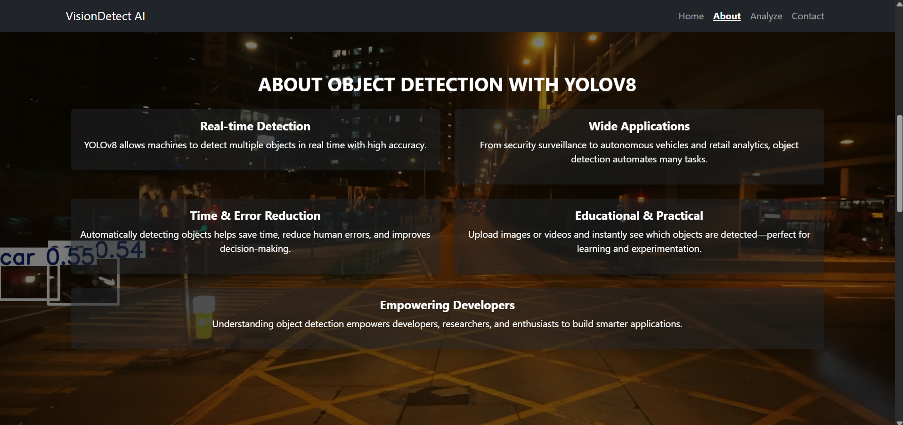
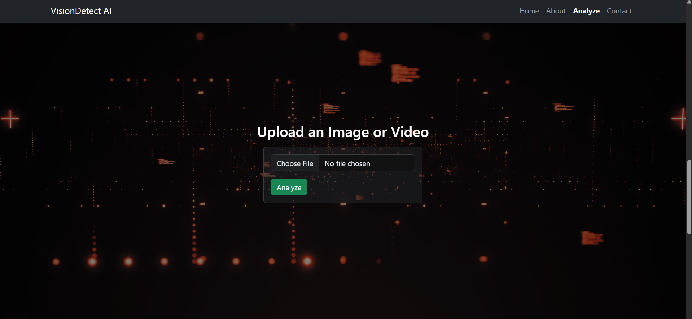
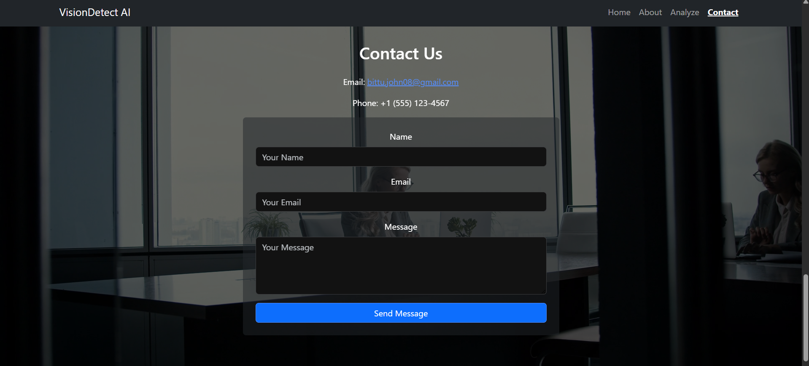

# VisionDetect-AI 🔍

VisionDetect-AI is an **Object Detection System** built using **YOLOv8**.  
It can detect multiple objects in real-time and provides accurate bounding boxes for each prediction.  

---

## 🚀 Features
- Real-time object detection with YOLOv8  
- Supports images, videos, and webcam streams  
- Lightweight and efficient for deployment  
- Easy to customize for new datasets  

---

## 📂 Project Structure
myproject/
├── objectdetection/
│ ├── screenshots/ # Screenshots of results
│ │ ├── screenshot1.png
│ │ ├── screenshot2.png
│ │ ├── screenshot3.png
│ │ └── screenshot4.png
│ ├── data/ # Dataset (if included)
│ ├── models/ # Trained YOLOv8 models
│ └── results/ # Output results after detection
└── README.md


---

## 🖼️ Screenshots  

### Homepage


### About


### Analyze


### Contact


---

## ⚙️ Installation  

Clone the repository:
```bash
git clone https://github.com/bittuz/VisionDetect-AI.git
cd VisionDetect-AI/myproject/objectdetection

Install dependencies:

pip install -r requirements.txt

▶️ Usage

Run object detection on an image:

python detect.py --source path/to/image.jpg


Run detection on a video:

python detect.py --source path/to/video.mp4


Run real-time detection with webcam:

python detect.py --source 0

📜 License

This project is licensed under the MIT License.

👨‍💻 Author

Developed by Bittu ✨

👉 Would you like me to also **add badges** (Python, YOLOv8, License, etc.) at the top of README for a more professional look?
